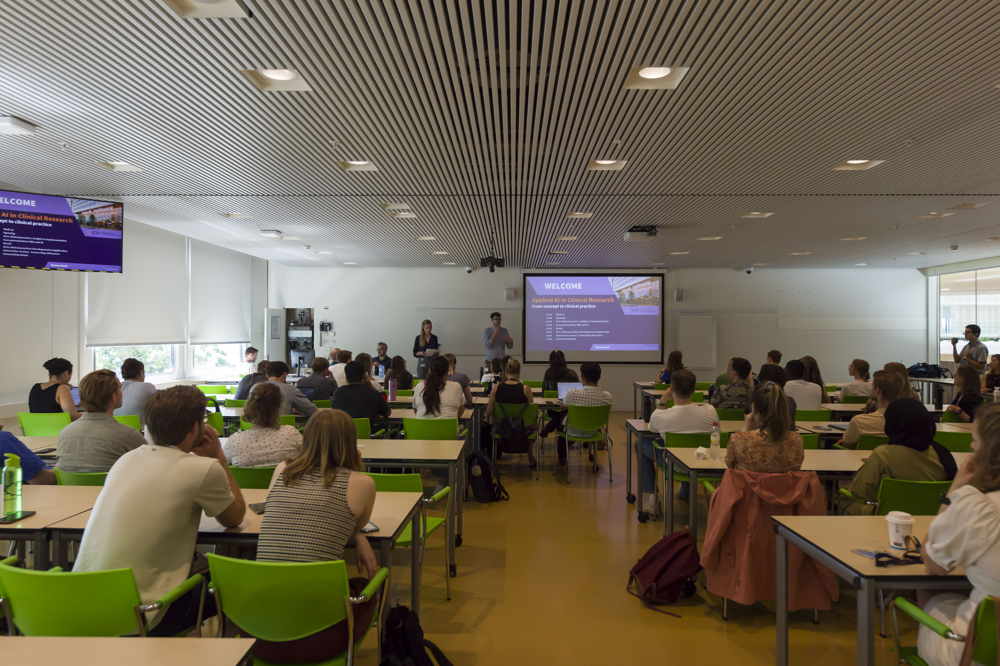
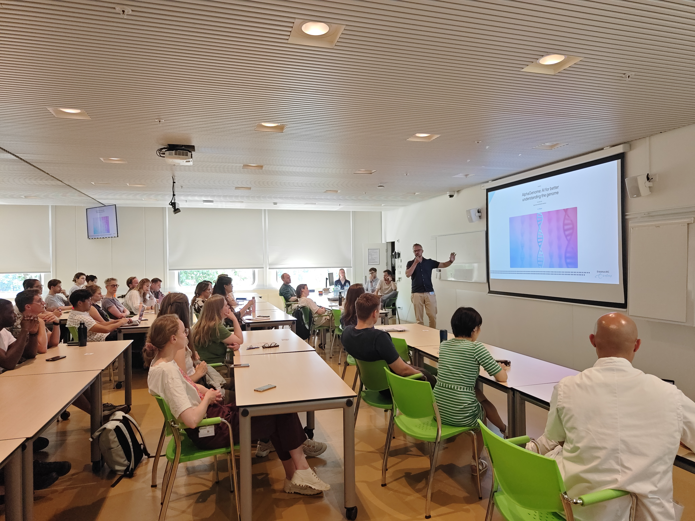
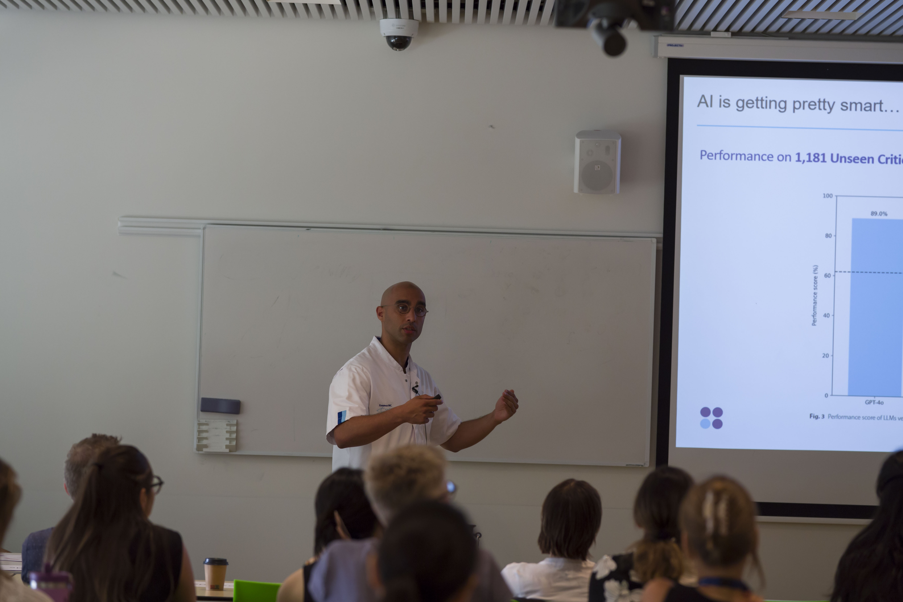
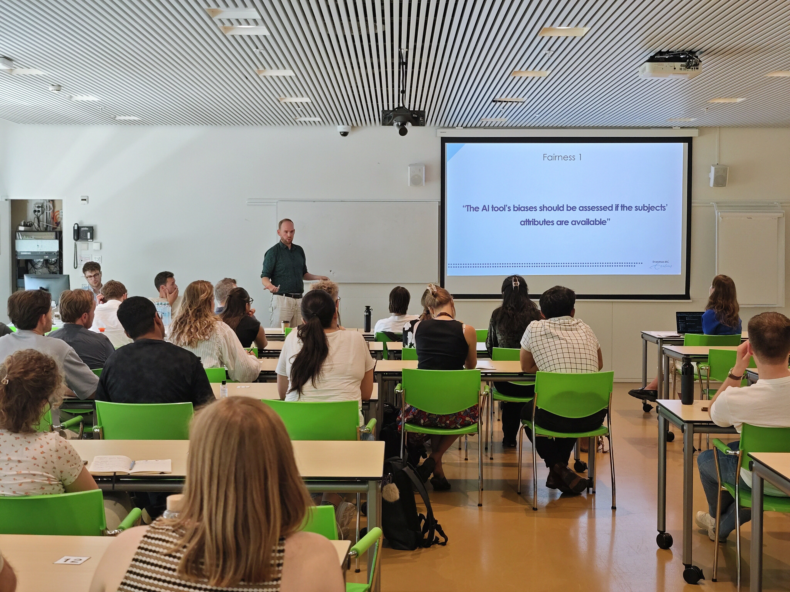
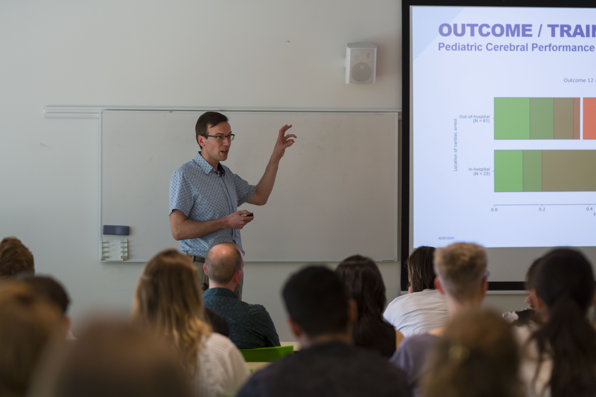
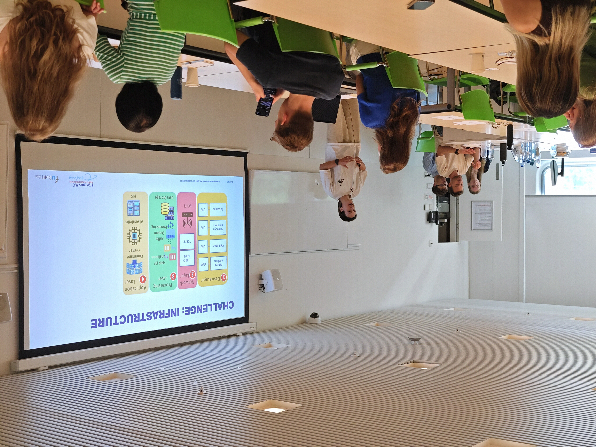
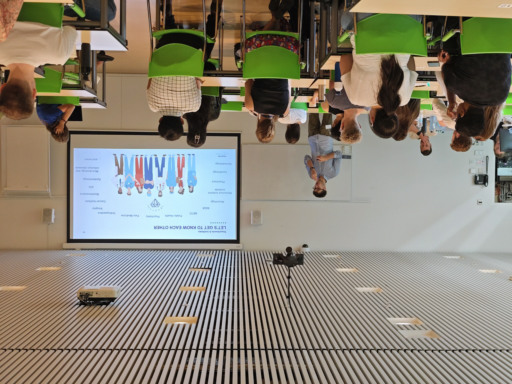

## 2025 Recap

A short look back at our **2025 edition**. Thanks to everyone who joined —
the talks, interactive session, and drinks made the day what it was.

<!-- Replace this intro with a few sentences about the 2025 event:
     how many attendees, the keynote highlights, what stood out, etc. -->

### Highlights
After Gennady Roshchupkin's fantastic opening, where he energized the audience with future perspectives and emphasized the important supporting organizations in the hospital, we were inspired by three expert-led sessions:

🔸Michel van Genderen & Martijn P. A. Starmans shared valuable insights into the implementation gap of AI in healthcare. Their deep dive into the WHO ethics guidance and FUTURE-AI guidelines gave us a roadmap to ensure AI tools are not just innovative, but actually usable in clinical settings.

🔹Robert van den Berg presented a fascinating real-world case combining EEG and AI, highlighting the concrete benefits of AI today. We also got a glimpse into his group's exciting work on self-supervised AI in pediatrics, which is a promising step forward for child healthcare.

🔸Eris van Twist tackled the practical side of innovation. From infrastructure and validation to collaboration and context-sensitive deployment, Eris emphasized that successful AI implementation is as much about systems and people as it is about algorithms.

We wrapped up with an energetic and creative interactive group session where participants, with similar research themes, worked together to draft mock research proposals.

### Photos

<!-- Drop your photos into an images folder (e.g. assets/2025/) and list them
     below. Add or remove <figure> blocks as needed. The gallery lays them out
     in a responsive grid automatically. -->

  <figure>
    
    <figcaption>Openning</figcaption>
  </figure>
  <figure>
    
    <figcaption>Gannady Roshchupkin - From models to medicine</figcaption>
  </figure>
  <figure>
    
    <figcaption>Michel van Genderen - Responsible AI implementation​: A clinical need and approach​</figcaption>
  </figure>
  <figure>
    
    <figcaption>Martijn P.A. Starmans - Why Most Healthcare AI Tools Aren’t Ready — and How to Change That: The FUTURE-AI Guideline </figcaption>
  </figure>
  <figure>
    
    <figcaption>Robert van den Berg - From neural network​ to neural net​</figcaption>
  </figure>
  <figure>
    
    <figcaption>Eris van Twist - AI in the PICU: from data to decisions​</figcaption>
  </figure>
  <figure>
    
    <figcaption>Interactive group session</figcaption>
  </figure>

You can read more about the 2025 edition on
[LinkedIn](https://www.linkedin.com/posts/icai-innovation-center-for-artificial-intelligence_aiinhealthcare-responsibleai-healthcareinnovation-activity-7350810812397101057-GJC3?utm_source=share&utm_medium=member_desktop&rcm=ACoAACSsu4wBsPlTdb-mA74_3s3vIo_fZnJ7GA4).

[← Back to home](./)
