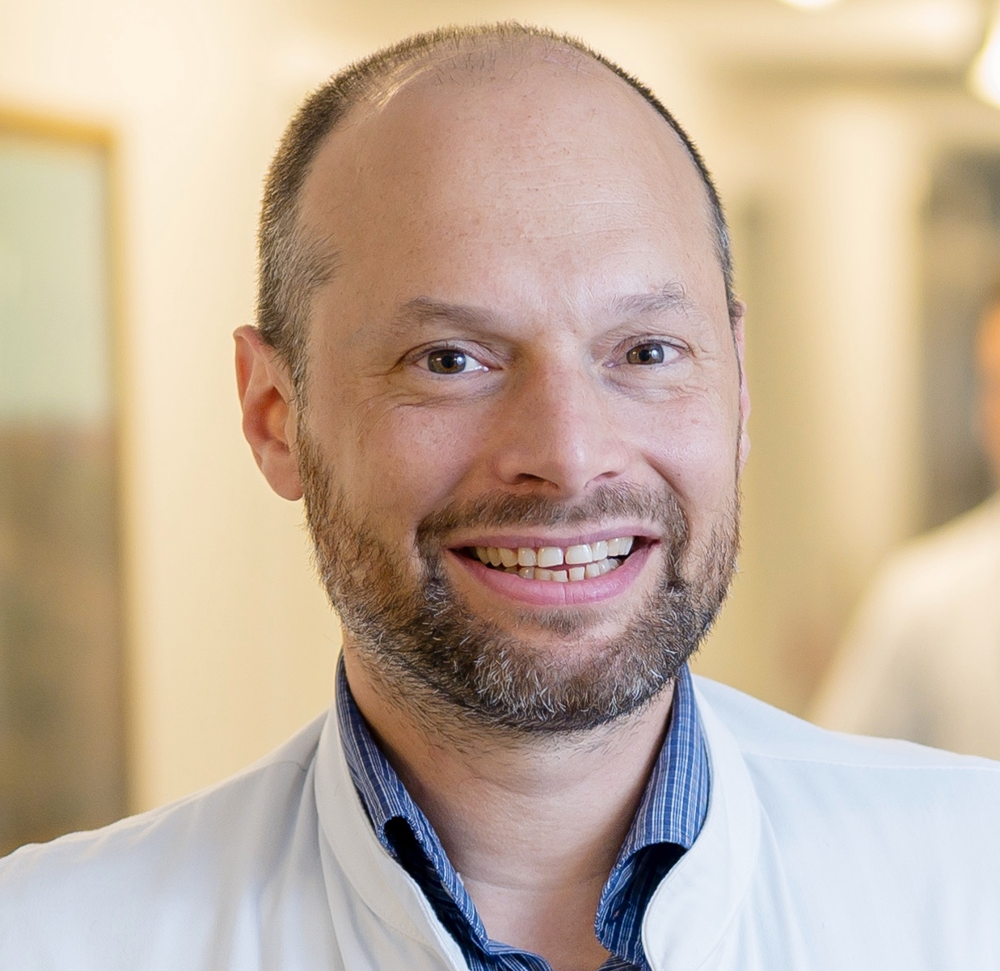
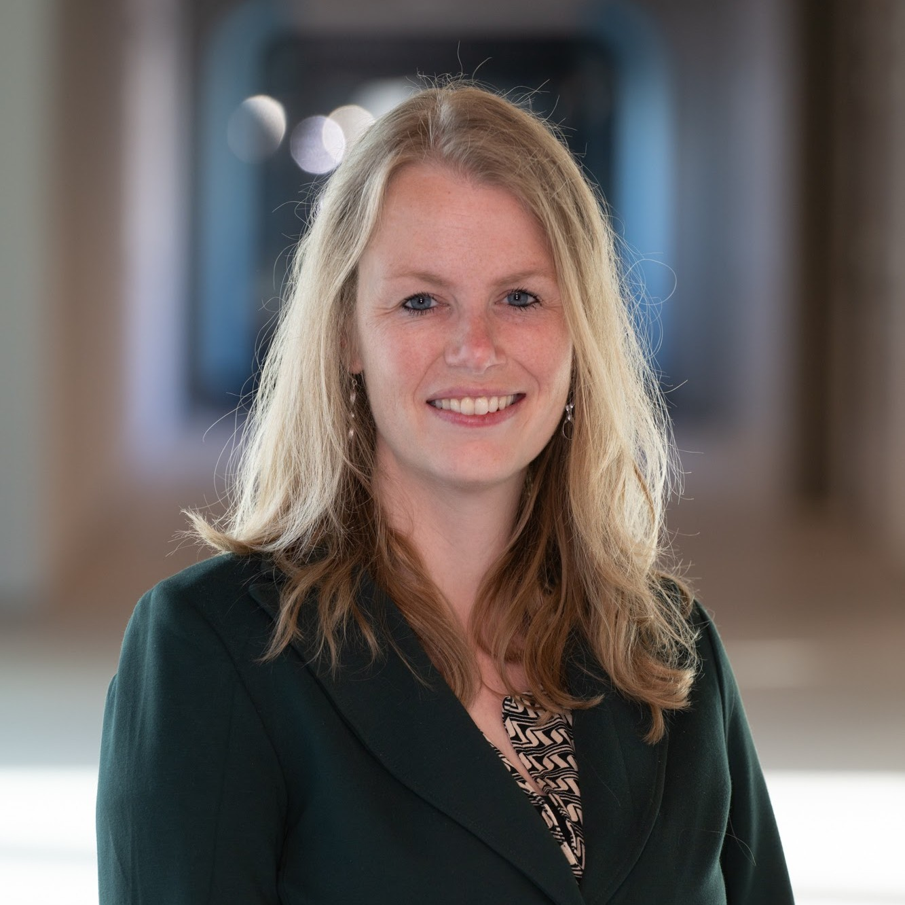
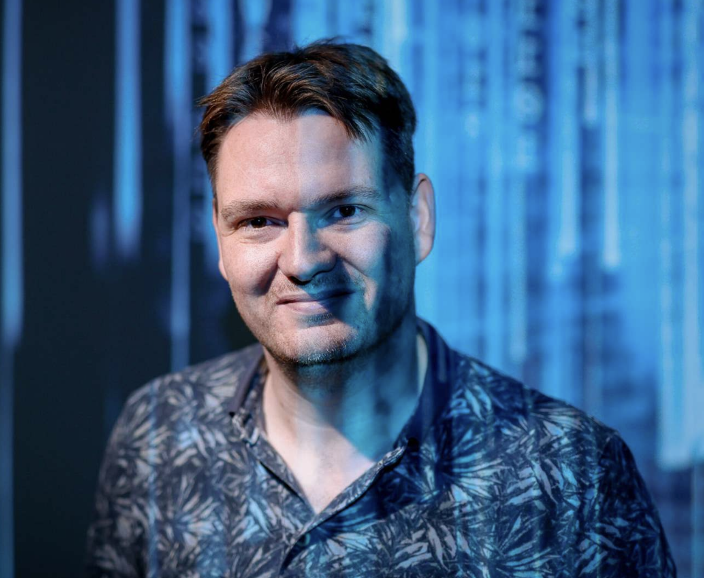
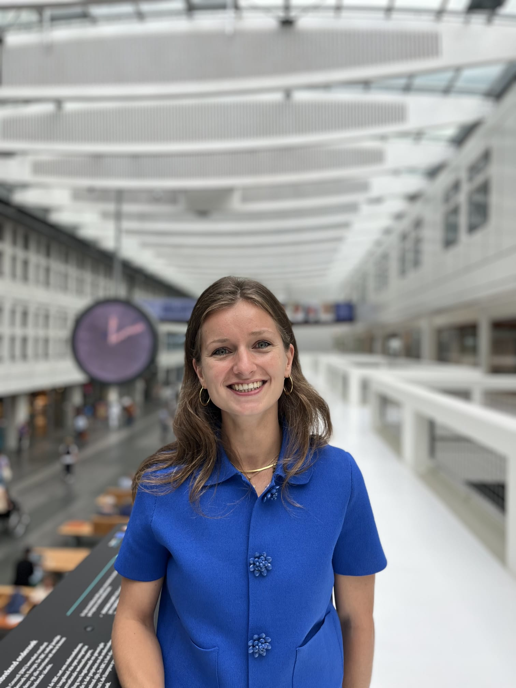
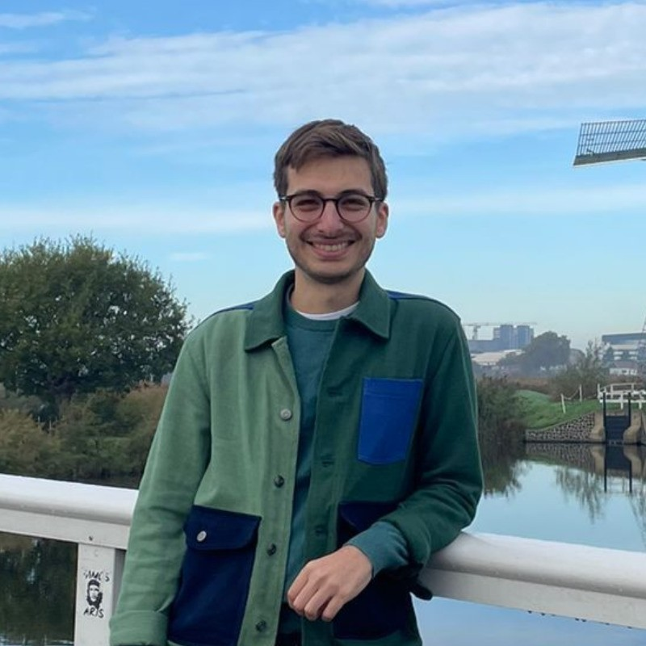
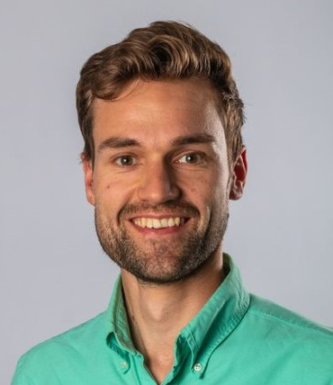
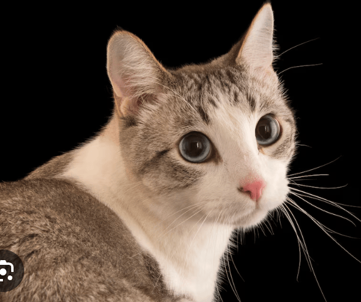
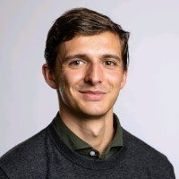
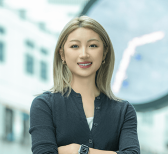
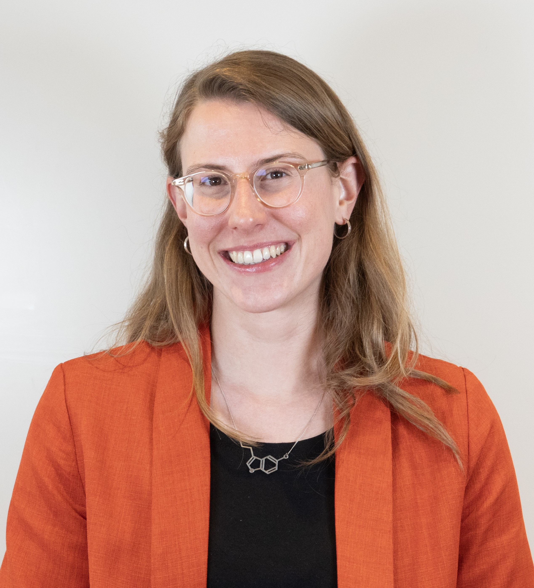

## Symposium: AI in Medical Research 2026

Welcome to the _Symposium: AI in Medical Research_ — for PhDs, postdocs, and anyone interested in translating AI research into clinical impact.

We aim to bring researchers together, promote interdisciplinary collaboration, build a community, and support researchers at different stages of AI integration.

After our successful [2025 edition](https://www.linkedin.com/posts/icai-innovation-center-for-artificial-intelligence_aiinhealthcare-responsibleai-healthcareinnovation-activity-7350810812397101057-GJC3?utm_source=share&utm_medium=member_desktop&rcm=ACoAACSsu4wBsPlTdb-mA74_3s3vIo_fZnJ7GA4), we're back with the **[AI Accelerator @Erasmus MC](https://www.linkedin.com/company/ai-accelerator-erasmus-mc/)** to organize the 2026 edition.

#### What to expect:
- Keynote talks
- Posters exhibition and contest
- Networking opportunities

#### Topics include:
- Technical insights
- Real-world AI applications
- Good practices in AI development and deployment

* * *
## Date
_Symposium: AI in Medical Research_ will take place on **October 28, 2026**.

## Location
The symposium will be held at Arminius Church (Museumpark 3, 3015 CB), Rotterdam.

<iframe src="https://www.google.com/maps/embed?pb=!1m18!1m12!1m3!1d2461.0397885060065!2d4.4712219767583035!3d51.91498517190883!2m3!1f0!2f0!3f0!3m2!1i1024!2i768!4f13.1!3m3!1m2!1s0x47c4349f837a3b69%3A0x503874b29538e9b8!2sArminius%20church!5e0!3m2!1sen!2ses!4v1781105591632!5m2!1sen!2ses" width="600" height="450" style="border:0;" allowfullscreen="" loading="lazy" referrerpolicy="no-referrer-when-downgrade"></iframe>

## Program 

| Time | Session |
|:------|:---------|
| 13:00 – 13:15 | Opening |
| 13:15 – 13:45 | Keynote: technical talk |
| 13:45 – 14:15 | Keynote: practical talk |
| 14:15 – 14:30 | Research pitches |
| 14:30 – 15:00 | Poster & Coffee break ☕️|
| 15:00 – 15:30 | Keynote: clinical talk |
| 15:30 – 15:45 | Research pitches |
| 15:45 – 16:45 | Speed research dating |
| 16:45 – 17:00 | Closing |
| 17:00 – 18.00 | Drinks! |

## Speakers

We have invited inspiring speakers working on translating AI research into clinical impact. Confirmed keynote speakers include:

  

    
    

      <h3 class="name"><a href="https://www.linkedin.com/in/martijn-bauer-79909b6/">Martijn Bauer</a></h3>
      
Leiden Univeristy Medical Center

      
Dr. Martijn Bauer is an internist at LUMC, where he mainly works in (sub)acute care. His great passion is making diagnoses as efficiently as possible, using methods including Bayesian reasoning and point-of-care ultrasound. In 2017, together with IT specialists, he began developing a software application that automatically creates a report of the conversation between healthcare provider and patient and extracts structured data from it. This led to the founding of the company <a href="https://www.linkedin.com/company/autoscriber/">Autoscriber</a>.

    

  

  

    
    

      <h3 class="name"><a href="https://estherbron.com/">Esther Bron</a></h3>
      
Erasmus Medical Center

      
Dr. Esther Bron is associate professor of neuroimage analysis and machine learning at Erasmus MC, Biomedical Imaging Group Rotterdam (<a href="https://bigr.nl">BIGR</a>), dept. Radiology & Nuclear Medicine. Her main research focus is on AI for image-based diagnosis and prediction in the field of neurological diseases, especially dementia, addressing challenges related to clinical translation of methods. In addition, she focuses on imaging data accessibility and has a leading role in national and European research infrastructure initiatives (Health-RI, Euro-BioImaging Population Imaging Node, Cancer Image Europe).

    

  

  

    
    

      <h3 class="name"><a href="https://geertlitjens.nl/">Geert Litjens</a></h3>
      
Radboud University Medical Center

      
Geert Litjens is a full professor of Artificial Intelligence for analysis of medical images in radiology and pathology at Radboud University Medical Center. His work focuses on the application of modern machine-learning methods to oncological pathology. Furthermore, he leads and participates in several research projects bridging the gap between medical specialties, such as prostate and pancreatic cancer, with a specific focus on developing multi-modal AI.

    

  

## Registration
The registration is free and includes coffee breaks and after-drink. We welcome anyone interested in applying AI to medical research attend.

[REGISTRATION LINK](https://ai-symposium-medresearch.github.io/2026/registration/)

## Organizing Committee

  

    
    

      <a href="https://www.erasmusmc.nl">Willemijn Berkhout</a>Logistics & Operation 
      Erasmus MC - Adult Intensive Care Unit 
      Netherlands
    

  

  

    
    

      <a href="https://www.erasmusmc.nl">Federico Ferraro</a>Promotion & Communication 
      Erasmus MC - Clinical Genetics 
      Netherlands
    

  

  

    
    

      <a href="https://www.erasmusmc.nl">Govert van der Gun</a>Finance & Sponsors 
      Erasmus MC - Rehabilitation Medicine 
      Netherlands
    

  

  

    
    

      <a href="https://www.erasmusmc.nl">Yannick ter Heerdt</a>Logistics & Operation 
      Erasmus MC 
      Netherlands
    

  

  

    
    

      <a href="https://www.erasmusmc.nl">Mirthe Kamphuis</a>Speakers & Program 
      Erasmus MC – Radiology & Nuclear Medicine 
      Netherlands
    

  

  

    
    

      <a href="https://www.erasmusmc.nl">Frank te Nijenhuis</a>Promotion & Communication 
      Erasmus MC – Radiology & Nuclear Medicine 
      Netherlands
    

  

  

    
    

      <a href="https://www.erasmusmc.nl">Gonzalo Mosquera Rojas</a>Logistics &amp; Operation 
      Erasmus MC – Radiology & Nuclear Medicine 
      Netherlands
    

  

  

    
    

      <a href="https://www.erasmusmc.nl">Jamie Verwey</a>Finance &amp; Sponsors  
      Erasmus University - Erasmus School of Health Policy & Management 
      Netherlands
    

  

  

    
    

      <a href="https://www.erasmusmc.nl">Xinyi Wan</a>Speakers &amp; Program 
      Erasmus MC – Radiology & Nuclear Medicine 
      Netherlands
    

  

  

    
    

      <a href="https://www.erasmusmc.nl">Karen van der Werff</a>Speakers &amp; Program 
      Erasmus MC – Radiology & Nuclear Medicine 
      Netherlands
    

  

## Contact
If you have any questions, please feel free to contact us at [ai.symposium@erasmusmc.nl](mailto:ai.symposium@erasmusmc.nl).

